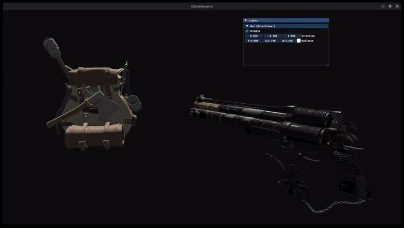
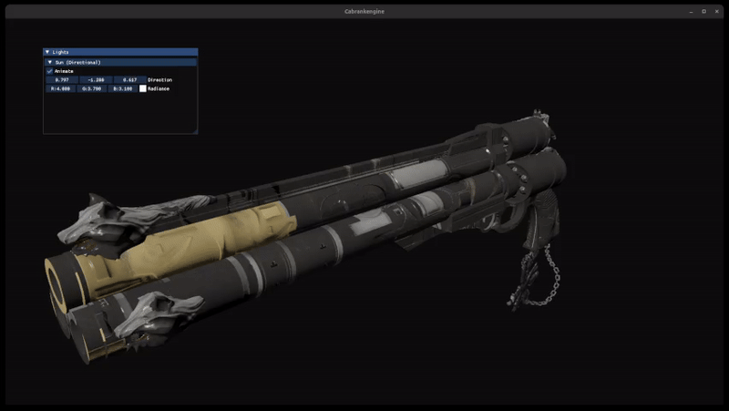

# Cabrankengine

A 2D/3D game engine written in C++23 with OpenGL 4.5, built from scratch as a learning project and portfolio piece. The engine covers the full stack: ECS architecture, a batch renderer, Phong and PBR material pipelines, scene serialization, a custom binary asset format, and a WebAssembly compilation target.

---

## Showcase

### Phong and PBR lighting



### PBR material detail



### Vampire Survivors style prototype


### 2D Batch Rendering


### ImGui Debug Overlay


---

## Features

- **Entity Component System** — Registry-based ECS with typed component arrays, signature-filtered systems, and up to 10 000 concurrent entities
- **2D batch renderer** — sprites, tiling, tint; all quads submitted in a single draw call
- **3D rendering** — Phong and PBR material pipelines (roughness/metalness, normal maps, HDR)
- **Lighting** — directional and point lights with attenuation
- **Camera system** — perspective and orthographic projections, first-person controller
- **Scene serialization** — save/load scenes from JSON; entities, components, and assets round-trip cleanly
- **Custom asset pipeline** — `CBKAssetConverter` converts `.obj/.fbx/.gltf` → `.cbkm` and images → `.cbkt`; PBR metal/roughness packing included
- **WebAssembly target** — engine compiles to WASM via Emscripten for browser deployment
- **ImGui integration** — real-time parameter editing and debug overlays
- **Collision shapes** — AABB, sphere, OBB, capsule, plane, cylinder (2D/3D)
- **Unit tests** — ECS, math, and collision solver covered with Catch2

---

## Quick Start

```cpp
// MyLayer.cpp
#include <Cabrankengine.h>
#include <Cabrankengine/Core/EntryPoint.h>

using namespace cbk;
using namespace cbk::scene::arch;

class MyLayer : public Layer {
public:
    MyLayer() : Layer("MyLayer") {
        // Camera with perspective projection + first-person controller
        CameraControllerArch camera(ProjectionType::Perspective);

        // 3D model with PBR materials
        PBRModelArch gun{ "assets/models/gun/Cerberus_LP.cbkm" };
        gun.transform().Position = { 2.f, -2.f, 2.f };
        gun.transform().Scale    = Vector3(0.1f);

        // Directional light
        DirectionalLightArch sun{};
        sun.light().Direction = { 0.f, -1.f, 0.f };
        sun.light().Radiance  = { 1.f, 1.f, 1.f };

        // Or load a saved scene
        // Application::get().loadScene(SceneSerializer::deserialize("scene.json"));
    }

    void onUpdate(Timestep dt) override {}
    void onImGuiRender() override {}
};

class MyApp : public Application {
public:
    MyApp() { pushLayer(std::make_unique<MyLayer>()); }
};

Application* cbk::createApplication() { return new MyApp(); }
```

For a step-by-step walkthrough see [docs/getting-started.md](docs/getting-started.md).

---

## Build

### Requirements

- C++23 compiler (GCC 13+ / Clang 17+ / MSVC 19.38+)
- [Premake5](https://premake.github.io/)
- **Vulkan SDK** (Linux default) — or OpenGL 4.5 fallback (see below)
- Metal — macOS *(WIP: compiles and renders with a hardcoded shader; material system not yet wired up)*
- GNU Make (Linux) or Visual Studio 2022 (Windows)

### Vulkan SDK (Linux)

The Linux backend defaults to Vulkan. Install the LunarG SDK with the `--set-dep-ld` flag (required by the latest installer to match the engine's linker config) and export `VULKAN_SDK`:

```bash
./vulkansdk-linux-x86_64-*.run --set-dep-ld
export VULKAN_SDK=$HOME/VulkanSDK/<version>/x86_64
```

To skip Vulkan and use OpenGL 4.5 instead, pass `--renderer=opengl` to Premake:

```bash
premake5 gmake --renderer=opengl
```

### Steps

```bash
# Clone with submodules (vendor dependencies are submodules)
git clone --recurse-submodules https://github.com/cabranca/game-dev.git
cd game-dev

# Generate build files
premake5 gmake      # Linux (Vulkan by default)
premake5 vs2022      # Windows (OpenGL by default)

# Build (debug by default)
make
make config=release

# Run the Sandbox example
./bin/Debug-linux-x86_64/Sandbox/Sandbox
```

For the asset converter:

```bash
make config=debug CBKAssetConverter
./bin/Debug-linux-x86_64/CBKAssetConverter/CBKAssetConverter assets/models/my_model.obj
```

---

## Documentation

| Doc | Description |
|-----|-------------|
| [Getting Started](docs/getting-started.md) | Prerequisites, build steps, first entity walkthrough |
| [Architecture](docs/architecture.md) | Module layout, ECS design, rendering pipeline, system execution order |
| [API Reference](docs/api-reference.md) | Registry, components, archetype builders |
| [Asset Pipeline](docs/asset-pipeline.md) | CBKAssetConverter — converting models and textures |

---

## Dependencies

| Library | Purpose |
|---------|---------|
| [GLFW](https://www.glfw.org/) | Window and input |
| [glad](https://glad.dav1d.de/) | OpenGL loader |
| [ImGui](https://github.com/ocornut/imgui) | Immediate-mode debug UI |
| [stb_image](https://github.com/nothings/stb) | Image loading |
| [spdlog](https://github.com/gabime/spdlog) | Logging |
| [nlohmann/json](https://github.com/nlohmann/json) | JSON serialization |
| [FreeType](https://freetype.org/) | Font rendering |
| [Catch2](https://github.com/catchorg/Catch2) | Unit testing |
| [Assimp](https://assimp.org/) | Model loading (asset converter only) |

---

## Roadmap

- [ ] Web editor (in progress — Cabrankeditor via WebAssembly)
- [ ] Vulkan renderer backend
- [ ] Finish Metal integration (macOS)
- [ ] WebGPU target
- [ ] SIMD math library
- [ ] Audio backend
- [ ] Scripting layer

---

## License

Not yet defined. Until then, the project is for personal learning and portfolio purposes only.

---

## Authors

- **Joaquin Cabrera** (cabranca) — creator and main developer
- **Francisco Pintar** (Franpintar) — contributor
